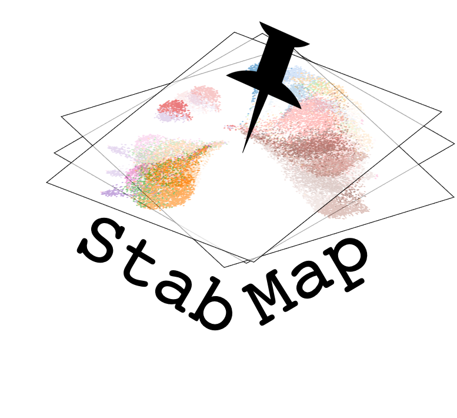
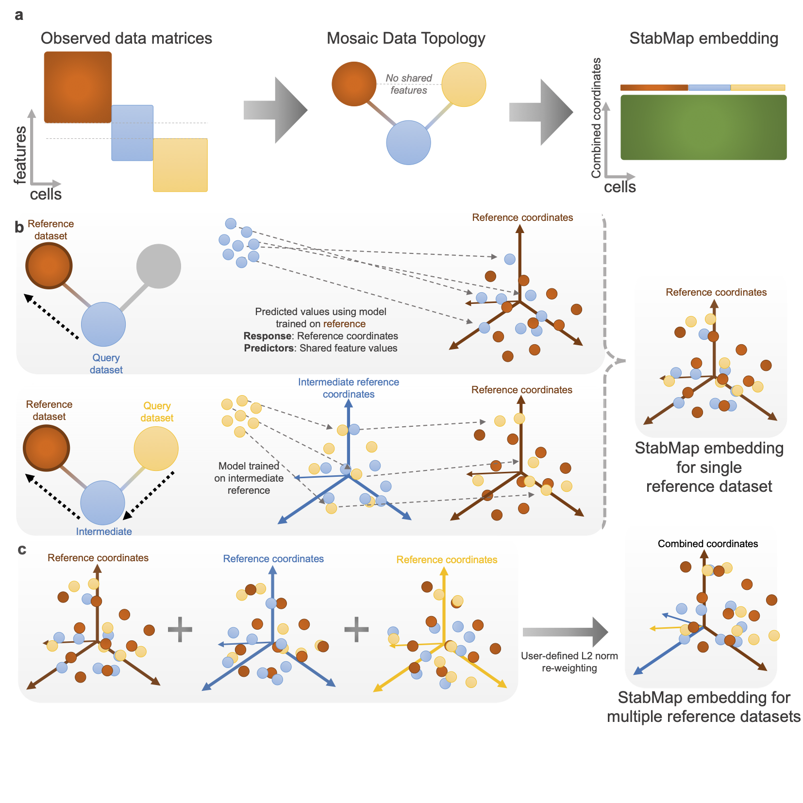

# StabMap: Stabilised mosaic single cell data integration using unshared features



## Installation

Install the following packages using `BiocManager`:

``` r
# install.packages("BiocManager")
BiocManager::install(c("scran"))
```

Then install `StabMap` using `devtools`:

``` r
library(devtools)
devtools::install_github("MarioniLab/StabMap")
```

## Vignette

You can find the vignette showing how StabMap can be used with PBMC single cell data at this [website](https://marionilab.github.io/StabMap/articles/stabMap_PBMC_Multiome.html).

## Method



**Figure: StabMap method overview.**\
a. Example mosaic data integration displaying observed data matrices with varying overlap of features among the datasets. Datasets are summarised using the mosaic data topology (MDT). Cells are then projected onto the common StabMap embedding across all cells.\
b. Cells from all datasets are projected onto the reference space (dark red) by traversing the shortest paths along the MDT. Blue cells are projected directly onto the reference space, whereas yellow cells are first projected onto the space defined by the blue cells, followed by projection to the dark red space. All cells are then combined to yield the common StabMap embedding.\
c. The process described in panel b is performed for various selected reference datasets (default = all), followed by L2-norm re-weighting provided by the user (default = equal weight). These reweighted embeddings are then concatenated to form the StabMap embedding for multiple reference datasets, and can be used for further downstream analysis tasks.

## Contact

shila.ghazanfar \<at\> sydney.edu.au, shila.ghazanfar \<at\> cruk.cam.ac.uk, or marioni \<at\> ebi.ac.uk.
