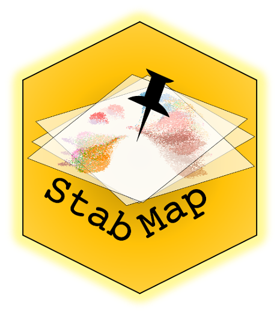

# StabMap: Mosaic single cell data integration using non-overlapping features


## Installation

Install the following packages using `BiocManager`:

```r
# install.packages("BiocManager")
BiocManager::install(c("scran"))
```

Then install `StabMap` using `devtools`:

```r
library(devtools)
devtools::install_github("MarioniLab/StabMap")
```

## Vignette

You can find the vignette showing how StabMap can be used with PBMC single cell data at this [website](https://marionilab.github.io/StabMap/articles/stabMap_PBMC_Multiome.html).

## Contact

shila.ghazanfar \<at\> cruk.cam.ac.uk or marioni \<at\> ebi.ac.uk
